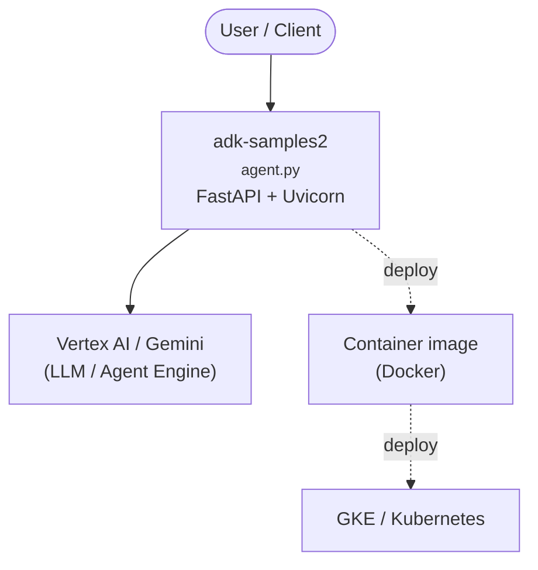

# Agent Development Kit (ADK) Samples

[](LICENSE)


Welcome to the ADK Sample Agents repository! This collection provides ready-to-use agents built on top of the [Agent Development Kit](https://google.github.io/adk-docs/), designed to accelerate your development process. These agents cover a range of common use cases and complexities, from simple conversational bots to complex multi-agent workflows.

## ✨ Getting Started 
This repo contains ADK sample agents for both **Python** and **Java.** Navigate to the **[Python](python/)** and **[Java](java/)** subfolders to see language-specific setup instructions, and learn more about the available sample agents. 

To learn more, check out the [ADK Documentation](https://google.github.io/adk-docs/), and the GitHub repositories for [ADK Python](https://github.com/google/adk-python) and [ADK Java](https://github.com/google/adk-java). 

## 🌳 Repository Structure
```bash
├── java
│   ├── agents
│   │   ├── software-bug-assistant
│   │   └── time-series-forecasting
│   └── README.md
├── python
│   ├── agents
│   │   ├── academic-research
│   │   ├── brand-search-optimization
│   │   ├── customer-service
│   │   ├── data-science
│   │   ├── financial-advisor
│   │   ├── fomc-research
│   │   ├── llm-auditor
│   │   ├── marketing-agency
│   │   ├── personalized-shopping
│   │   ├── RAG
│   │   ├── README.md
│   │   └── travel-concierge
│   └── README.md
└── README.md
```

## ℹ️ Getting help

If you have any questions or if you found any problems with this repository, please report through [GitHub issues](https://github.com/google/adk-samples/issues).

## 🤝 Contributing

We welcome contributions from the community! Whether it's bug reports, feature requests, documentation improvements, or code contributions, please see our [**Contributing Guidelines**](https://github.com/google/adk-samples/blob/main/CONTRIBUTING.md) to get started.

## 📄 License

This project is licensed under the Apache 2.0 License - see the [LICENSE](https://github.com/google/adk-samples/blob/main/LICENSE) file for details.

## Disclaimers

This is not an officially supported Google product. This project is not eligible for the [Google Open Source Software Vulnerability Rewards Program](https://bughunters.google.com/open-source-security).

This project is intended for demonstration purposes only. It is not intended for use in a production environment.

<!-- ARCH-DIAGRAM:START -->

## Architecture

> Auto-generated architecture diagram. See [`docs/context-map.md`](docs/context-map.md) for the full context map (core application, containers/cloud, and database connections).



<!-- ARCH-DIAGRAM:END -->
