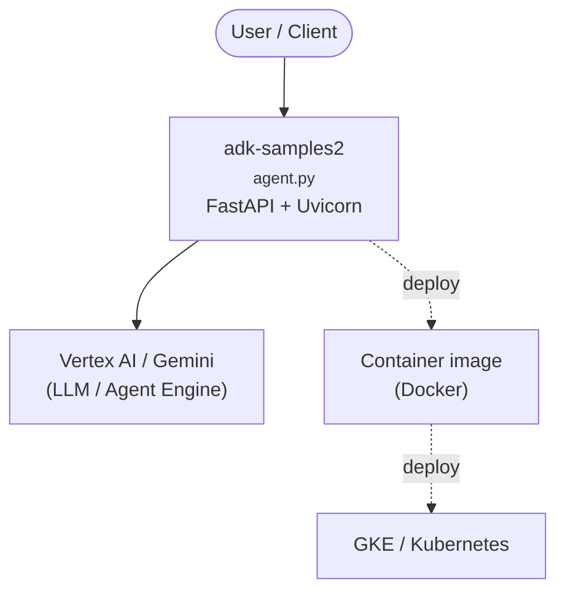

# Context Map — `adk-samples2`

> Auto-generated architecture & deployment context map. Summarizes the core application, container/cloud footprint, and database connections. Regenerate after significant structural changes.

**Repo:** `avnit/adk-samples2` · **Original** · Public · Primary language: Python · Default branch: `main` · Files: 116

## 1. Core application

Agent Development Kit (ADK) Samples

- **Frameworks / runtime:** FastAPI + Uvicorn
- **Entry points:** `python/agents/RAG/rag/agent.py`, `python/agents/llm-auditor/llm_auditor/agent.py`, `python/agents/llm-auditor/llm_auditor/sub_agents/critic/agent.py`, `python/agents/llm-auditor/llm_auditor/sub_agents/device_42/agent.py`, `python/agents/llm-auditor/llm_auditor/sub_agents/reviser/agent.py`, `python/agents/llm-auditor/llm_auditor/sub_agents/wiz/agent.py`
- **Listens on port(s):** 8080

## 2. Containers & cloud applications

**Containers:**
- `python/agents/llm-auditor/Dockerfile`
- `python/agents/wiz/wiz-mcp/Dockerfile`

**Detected cloud platforms / services:** Vertex AI / Gemini (GCP), Google Cloud Run, GKE / Kubernetes

## 3. Database connections

_No database drivers or connection strings detected._

**Environment / config files:** `python/agents/RAG/.env.example`

## 4. Architecture diagram

## 5. Security posture

- **Dependabot alerts (open):** 5 high, 3 medium

---
_Generated by repo context-mapping pass on 2026-08-13._